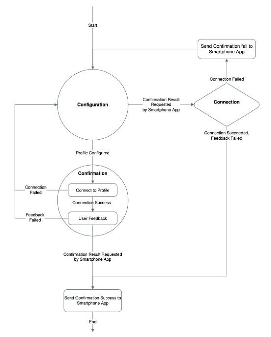

#################
Wifi Connectivity
#################

The wireless connectivity subsystem is responsible for the wireless data transmission. This subsystem  connects  the  host  (microcontroller)  to  the  cloud  server  (website)  to  enable  datatransmission  using  radio  frequency.  
To  establish  the  wireless  connection,  the  microcontroller should be provided with a radio module (antenna) that could send and receive data using one of the data transmission protocols within the frequency range of the wireless protocol. 
One of the most common wireless protocols is IEEE 802.11, which is also known as Wi-Fi. Most of the 802.11 techniques use a short-range radius to transmit signals in the 2.4-GHz ISM (Information system management) frequency band. 
This subsystem  interacts  wirelessly  with  the  webserver  to transmitthe  data  collected from  the  daughterboard  on  the  host. The data  is  transferred  on  the  network  using  the  http application layer protocol. In the http protocol,the hostin its role of client, sends a request to a Web server. The server then returns a response to that client. A client may take further action basedon the server’s response, but http considers that action to be an entirely new exchange. The new exchange, like every http exchange, begins with a client’s request.

Wi-Fi provisioning is the process of connecting a new Wi-Fi device (station) to a Wi-Fi network. The provisioning process involves loading the station with the network name (often referred to as SSID) and its security credentials [1].
Provisioning in Access Point (AP) mode is the most common provisioning method today for headless devices. In AP mode the un-provisioned device wakeup initially as an AP with an SSID defined by the equipment manufacturer.
In this mode, the un-provisioned device also includes a secured embedded web server as figure 3 demonstrates. After the user connects his smartphone to the un-provisioned device’s AP, he opens the smart phone’s web browser and browses into the device’s web site via the local URL or IP address of the chip web module [1]. 
In the embedded web site, the user types the home network name and password. The device stores the network credentials in the memory and then it switches from AP mode to Station mode in order to connect to the home network using the stored network credentials.
